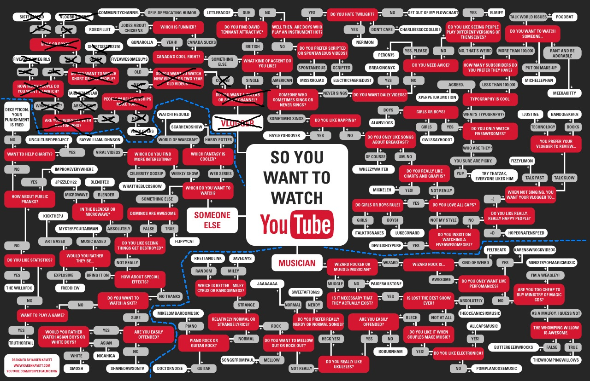

# Youtube flow chart

## Description

This program is the representation of youtube flowchart. The flowchart was made in CLIPS but the whole interface was made in Python using clipspy library. The user interface was made in plain HTML and CSS with Flask framework as backend. The communication between user and backend was made with websockets.



## Instructions

- Create virtual environment:

    ```python -m venv venv```

- Activate virtual environment:

    ```source venv/Scripts/Activate```

- Install required libraries:

    ```pip install -r requirements.txt```

- Run the program with python:

    ```python main.py```

You should be able to open 127.0.0.1:5000 at your browser.

